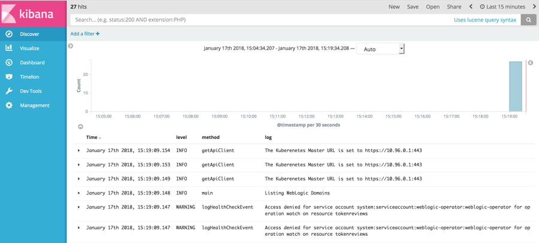

# ELK integration

TODO Update this whole section
Turn on Logstash in operator
Add the ENABLE_LOGSTASH env in weblogic-operator.yaml to the env section
name: ENABLE_LOGSTASH value: "true"
Create the PV and PVC for the operator logs
kubectl create -f elk-pv.yaml
Verify if PV and PVC are created kubectl get pv -n weblogic-operator kubectl get pvc -n weblogic-operator
Deploying the ELK stack
ELK stack consists of Elasticsearch, Logstash, and Kibana. Logstash is configured to pickup logs from the operator and push to Elasticsearch. Kibana is setup to connect to Elasticsearch to read the log and shows it on the dashboard.
Deploying Elasticsearch
kubectl create -f elasticsearch.yaml
Deploying Kibana
kubectl create -f kibana.yaml
Deploying Logstash
kubectl create -f logstash.yaml
Verify if ELK stack pods are created and running kubectl get pods -n weblogic-operator kubectl get pods
Accessing the Kibana dashboard
Get the NodePort from kibana services kubectl describe service kibana
Access Kibana dashboard using NodePort from output of the above kubctl command and the hostname http://hostname:NodePort (eg. http://slcac571:30211)
Select the Management tab to configure an index pattern. You will see logstash-* prepopulated, select the time filter then press the create button Then select the Discover tab to see the logs

